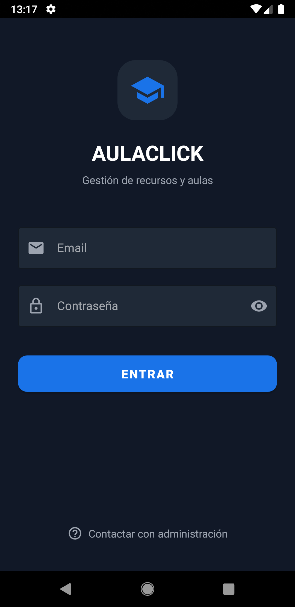
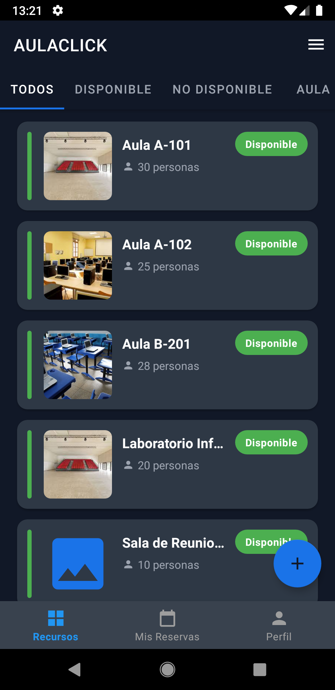
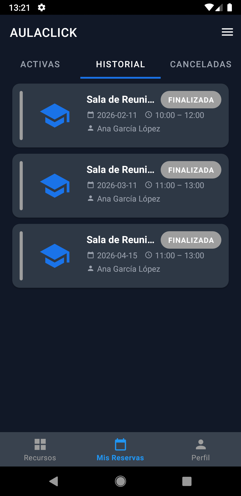
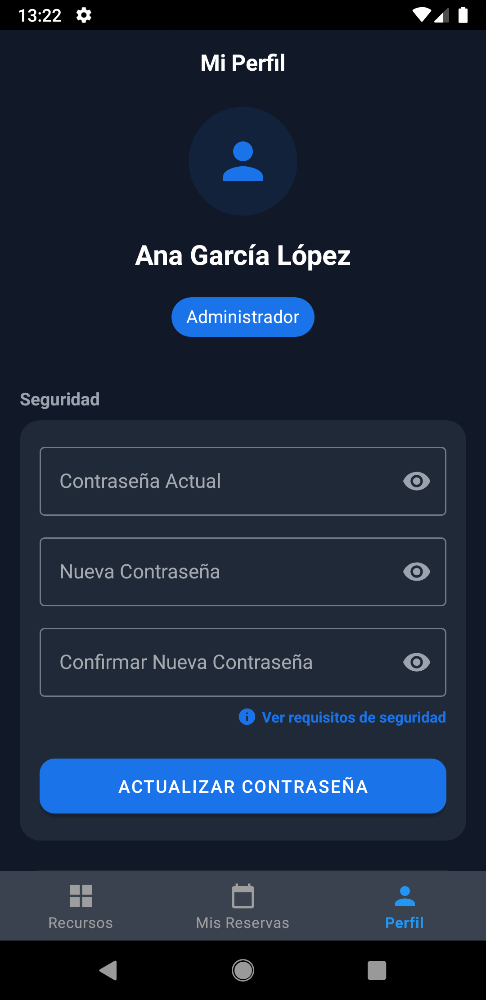
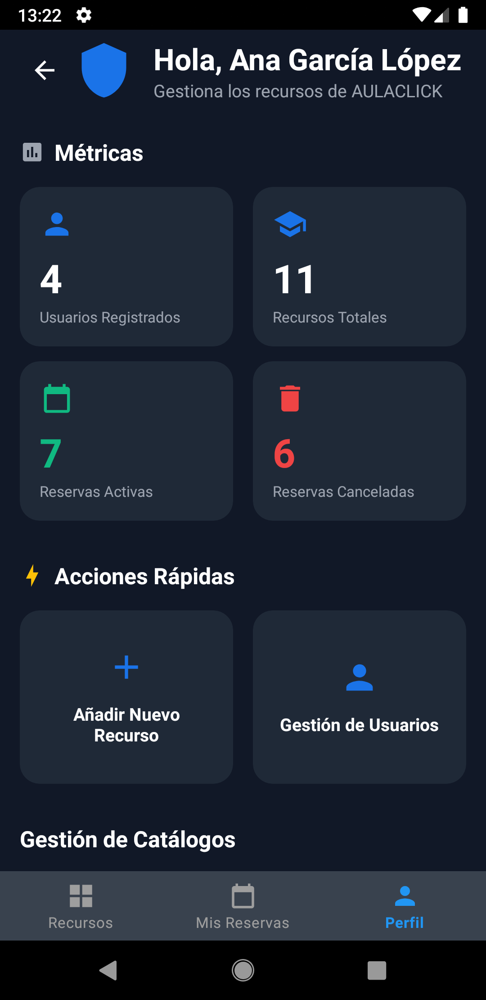

# AulaClick - Aplicación Android

AulaClick es la aplicación cliente para el sistema de reserva de recursos, aulas y equipamiento. Desarrollada de forma nativa en **Android** (Java), esta aplicación permite a los usuarios (estudiantes y personal) buscar recursos disponibles, consultar su disponibilidad y realizar reservas dinámicas directamente desde sus dispositivos móviles.

## Características Principales

- **Gestión de Reservas:** Creación, visualización y gestión de reservas en tiempo real.
- **Validación Dinámica:** Comprobación de reglas operativas (fines de semana, horarios de apertura y cierre) del recurso seleccionado.
- **Interfaz Moderna:** Diseño basado en Material Design, con un enfoque claro en la experiencia del usuario (por ejemplo, `TextInputLayout` para errores de inicio de sesión).
- **Consumo de API RESTful:** Comunicación segura y eficiente con el backend de AulaClick en Spring Boot usando Retrofit/Volley.

## Capturas de Pantalla

| Pantalla de Login | Panel Principal | Detalles y Reserva | Perfil | Panel de administración |
| :---: | :---: | :---: |
| :---: | :---: 
|  |  |  |  | |

## Requisitos Previos

- **Android Studio** (versión Iguana o superior recomendada).
- **SDK de Android:** Nivel de API mínimo 24 (Android 7.0) o el definido en `build.gradle`.
- El **backend de AulaClick** debe estar en ejecución para realizar la autenticación y las peticiones a la API.

## Guía de Instalación y Ejecución

1. **Clonar el Repositorio:**
   ```bash
   git clone <url-del-repositorio>
   ```
2. **Abrir el Proyecto:**
   Abre Android Studio y selecciona `File > Open`, luego navega hasta el directorio `aulaclickandroid`.
3. **Configurar la URL del Backend:**
   Verifica la configuración de la IP del servidor en la clase de red (`RetrofitClient`, `NetworkUtils`, etc.) en `app/src/main/java/com/aulaclick/network/`. Asegúrate de que apunta a la IP de tu máquina local si estás probando en el emulador (ej. `10.0.2.2:8080`) o la IP en red local si usas un dispositivo físico.
4. **Sincronizar Gradle:**
   Haz clic en "Sync Project with Gradle Files" para descargar todas las dependencias necesarias.
5. **Ejecutar la Aplicación:**
   Conecta un dispositivo físico o inicia un emulador y haz clic en el botón **Run** (`Shift + F10`).

## Estructura del Código
- `com.aulaclick.app`: Contiene las actividades (Activities) y fragmentos (Fragments) principales.
- `com.aulaclick.app.network`: Clases para realizar peticiones HTTP.
- `com.aulaclick.app.utils`: Utilidades y adaptadores (`Adapters`) para las listas.

## Documentación

El código fuente incluye comentarios JavaDoc para las clases y métodos más importantes, detallando los flujos de implementación, especialmente en `AnadirRecursoActivity`, `DetalleRecursoActivity`, y los Modelos (Entidades).
